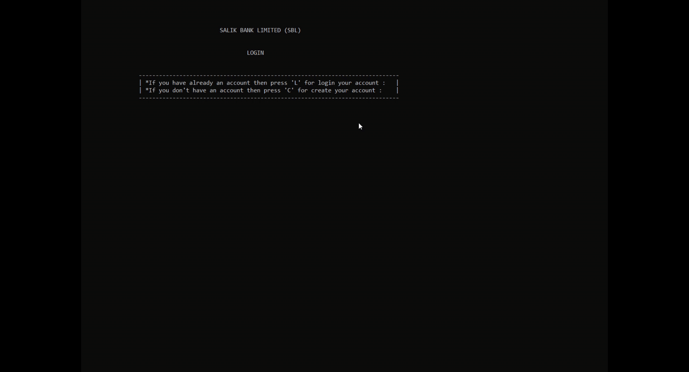

<h1 align="center" style="font-size: 52px;" > Welcome to BANKIST APPLICATION  👋</h1>

> Bankist application in `C++` by using `DYNAMIC MEMPRY ALLOCATION` and `OBJECT_ORIENTED_PROGRAMMING` concepts. Its main features are login system, user authentication ,create a new account , requesting loan , transfer money, sort your movements , currency converter , delete your account and log out system .

# ✨ Demo

`Bankist project` main feature is `abstraction` and `data-encapsulation`.Main contain only `default` accounts data, memory allocation and deallocation and one executed external function.

  

# Usage

### Default Accounts for login:

| username | password |
| -------- | -------- |
|    ma    |   111    |
|    aa    |   222    |
|    bs    |   333    |

# 🚀 Features:

- How to use the `Dynamic Memory Allocation` .
- Data hiding and Encapsultion of Classes .
- Real World Banking system .
- Login, create new account system.
- Requesting Loan ,Transfering loan system.
- Sort your movements and delete your account system.
- All input validations are done .
- No memory leakage in run-time all dynamic memory is deallocated.

# Author

### 👨‍💻 Aniket Khandave

   

Let's connect!

